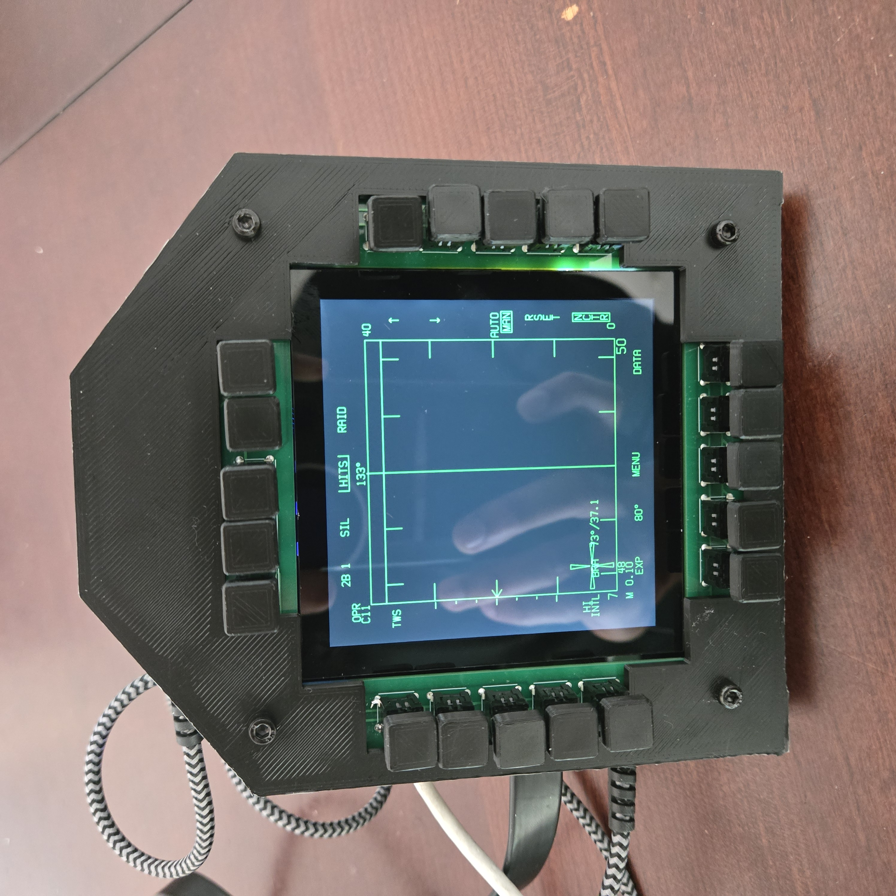
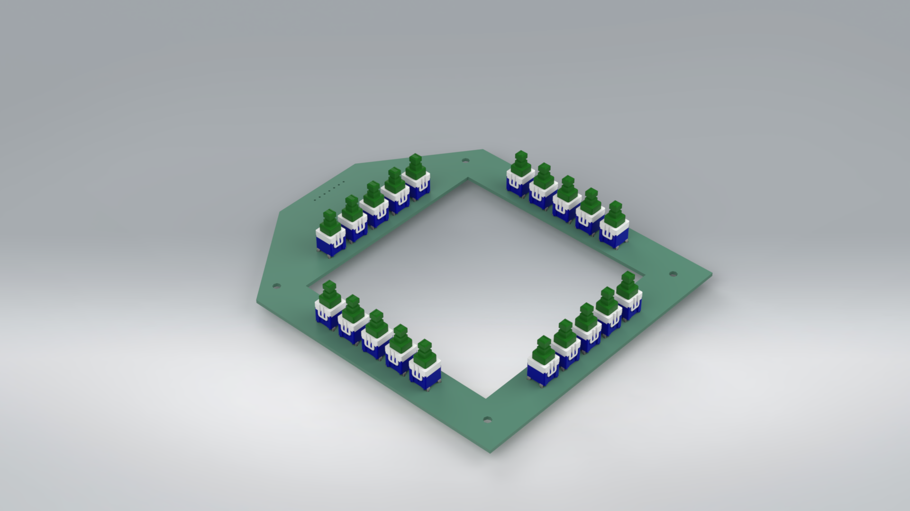

# Open Source F18 DDI for DCS

Quick project to build a functional Digital Display Indicator for the F18 Hornet in DCS World. The project is not meant to be a replica of the real device but act as a completely functional module to enhance the immersion and combat experience. Here's a demo:

[https://youtu.be/Hzj8HVoCLto](https://youtu.be/Hzj8HVoCLto)

### Bill of Materials

| Item Name | Price | Quantity | Purchase Link | Notes |
| --- | --- | --- | --- | --- |
| Custom PCB | $32 for 5 | 1 | [https://jlcpcb.com/](https://jlcpcb.com/) | Gerber files available in the repository, can order from any online PCB manufacturer. I like JLCPCB |
| Panasonic ESE-20D443 Switches | $1.18 | 20 | [https://www.digikey.com/en/products/detail/panasonic-electronic-components/ESE-20D443/593515](https://www.digikey.com/en/products/detail/panasonic-electronic-components/ESE-20D443/593515) | Available on Digikey or Mouser |
| Waveshare 4inch HDMI Capacitive Touch IPS LCD | $66 | 1 | [https://www.waveshare.com/4inch-hdmi-lcd-c.htm](https://www.waveshare.com/4inch-hdmi-lcd-c.htm) | Quicker shipping on Amazon but more expensive |
| Seed Studio Xiao Samd21 | $5.4 | 1 | [https://www.seeedstudio.com/Seeeduino-XIAO-Arduino-Microcontroller-SAMD21-Cortex-M0+-p-4426.html?srsltid=AfmBOoq5dJ23LE_dqcqwzZtpAwAl_5tHTdahaePdUQaOJm6XNmBkNnsp](https://www.seeedstudio.com/Seeeduino-XIAO-Arduino-Microcontroller-SAMD21-Cortex-M0+-p-4426.html?srsltid=AfmBOoq5dJ23LE_dqcqwzZtpAwAl_5tHTdahaePdUQaOJm6XNmBkNnsp) |  |
| M3 Bolts | $7.99 | 1 | [https://a.co/d/crp1qAX](https://a.co/d/crp1qAX) |  |
| M2.5 Bolts | $7.57 | 1 | [https://a.co/d/fGeQGS1](https://a.co/d/fGeQGS1) |  |

Total: $142

### Assembling the Module

**Step 1:** Solder header pins of the Seed Studio Xiao to the PCB and then solder on the board itself. A small dot on the PCB marks pin 1 of the board

**Step 2:** Solder the 20 push switches on the PCB

**Step 3:** Flash the Xiao board (see below)

**Step 4:** Mount the Display into the backplate using the M2.5 bolts

**Step 5:** Place the PCB in the backplate, place the front plate on it, and then secure all three using the M3 bolts

### Flashing the Microcontroller on Arduino IDE

**Step 1:** Download Arduino IDE - [https://www.arduino.cc/en/software/](https://www.arduino.cc/en/software/)

**Step 2:** Open the attached sketch in the IDE

**Step 3:** Add Seed studio board to the IDE - [https://wiki.seeedstudio.com/Seeed_Arduino_Boards/](https://wiki.seeedstudio.com/Seeed_Arduino_Boards/)

**Step 4:** In the library manager install the **HID-Project** library by NicoHood

**Step 5:** Set the Xiao to bootloader mode

**Step 6:** Under Tools → USB Stack, choose Arduino or Native

**Step 7:** Hit upload

**Step 8:** Disconnect and reconnect the microcontroller for it to appear as a joystick/controller

**Note:** If it does not appear as a joystick, find the device in device manager, and uninstall driver, then reconnect the device.

### Configuring DCS

**Exporting Displays:**

Exporting specific displays can be achieved via creating lua files: [https://wiki.hoggitworld.com/view/Exporting_MFCD_Displays](https://wiki.hoggitworld.com/view/Exporting_MFCD_Displays). Sample Lua for this DDI is attached to the repo. First set up your displays in windows as the following before continuing. Adjust the resolution in the lua file to match your resolution.

**Button Mappings:**

The DDI will detect like a regular gamepad/controller with 20 buttons. In the F18 DCS module, button one of the DDI is the bottom most button of the left bank. Choose the command in DCS then click the appropriate button on the module to map.